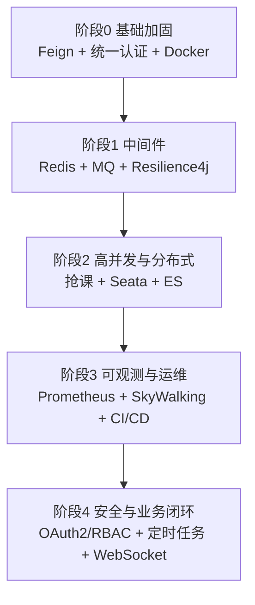

# 🚀 网上选课系统 — 深度化改造路线图

> **版本**: v1.0
> **日期**: 2026-08-04
> **目标**: 把当前 Spring Cloud 微服务项目深化为具有完整工程化、高并发、可观测性、安全体系的"深度项目"。
> **原则**: 保留并深化 Spring Boot/Spring Cloud 生态，不推翻重写；每一步都保持现有功能可用。

---

## 0. 现状盘点

| 维度 | 现状 |
|------|------|
| 架构 | Eureka + Gateway + 6 个业务服务（web/user/student/teacher/course/selection）+ common-lib |
| 认证 | 双机制并存：Gateway 层 JWT Filter + web-service Session 登录 |
| 数据访问 | 各服务直连共享 MySQL（JPA 与 MyBatis-Plus 并存） |
| 服务间调用 | 基本不存在（共享库掩盖了调用边界），Gateway 有基础熔断/fallback |
| 缓存/消息/检索 | 无 Redis、无 MQ、无 ES |
| 部署 | 手工 `mvnw spring-boot:run` / `start-microservices.ps1`，无容器化 |
| 可观测 | 无 Prometheus/Grafana/链路追踪 |
| 定时任务/实时推送 | 无 |

---

## 1. 阶段 0：基础加固（必须先做，其他阶段的依赖）

> 当前"各服务直连共享库 + Session/JWT 双认证"是深度化的最大阻碍。不先统一调用与认证边界，后面的 Redis/MQ/事务都无从谈起。

### 1.1 统一服务间调用（OpenFeign 骨架）
- **现状**：服务间无调用，业务靠共享库直接读写。
- **目标**：引入 `spring-cloud-starter-openfeign`，抽公共服务边界。
  - `user-service`：提供用户/权限校验
  - `course-service`：课程/学院/系部/专业
  - `selection-service`：选课/成绩
  - `student-service` / `teacher-service`：学生/教师
- **产出**：`common-lib` 放 Feign 接口 + DTO；各服务声明 `@FeignClient(name=...)`。

### 1.2 统一认证体系（JWT + Redis 会话）
- **现状**：Gateway JWT Filter + web-service Session 并存，登录态割裂。
- **目标**：
  - 收敛为统一 JWT（OAuth2 风格 `access_token`）
  - 引入 Redis 存 token/会话（可踢人、可续期、可黑名单）
  - Gateway 统一鉴权过滤器（路径 + 角色 + 权限）
- **产出**：`user-service` 认证中心 + `RedisTokenStore` + Gateway 统一 `AuthFilter`。

### 1.3 Docker 化基础
- **现状**：本地手工起服务。
- **目标**：每个服务一个 `Dockerfile` + 根目录 `docker-compose.yml` 一键起：
  - `mysql`（挂载 `db/init-*.sql` 初始化）
  - `redis`
  - `rabbitmq`
  - `eureka-server` / `gateway-server` / 6 个业务服务
- **产出**：`./docker-compose up -d` 即可跑通全链路。

---

## 2. 阶段 1：中间件深化（缓存 + 消息 + 服务容错）

### 2.1 Redis 缓存层
- **场景**：课程列表/热门课程、首页仪表盘聚合数据、公告、验证码。
- **技术**：`spring-boot-starter-data-redis` + `@Cacheable` / 手动 `StringRedisTemplate`。
- **要点**：缓存失效策略（课程被改/删除/审批通过时主动删缓存）；`cache-aside` 模式；防缓存穿透/击穿。

### 2.2 消息队列（RabbitMQ 优先，Kafka 可选）
- **场景**：
  - 选课/退课/审批通过后异步发通知
  - 操作日志异步写库（`operation-log`）
  - 课程公告广播（学生端顶部横幅）
  - 高并发削峰（见阶段 2 抢课）
- **技术**：`spring-boot-starter-amqp`；交换机 + 队列 + 死信队列 + 重试。

### 2.3 服务容错（OpenFeign + Resilience4j）
- **现状**：服务间无调用 → 无熔断。
- **目标**：1.1 的服务间调用全部挂上 `Resilience4j`（超时/重试/熔断/限流）+ 统一 fallback。
- **产出**：调用方无感降级（如课程服务挂了，选课页仍可打开并提示）。

---

## 3. 阶段 2：高并发与分布式（选课核心场景深挖）

### 3.1 抢课高并发（本项目的"招牌场景"）
- **目标**：同一门课大量学生同时选。
- **方案（按复杂度递增）**：
  1. **接口限流**：Gateway + Redis 令牌桶/计数器限流。
  2. **Redis 预扣 + 异步落库**：Redis 原子扣减剩余名额（`DECR`），成功进 MQ，消费者批量落库。
  3. **乐观锁**：`course_selection`/`course` 加 `version`，防超卖。
  4. **本地+分布式锁**（Redisson）防同人重复抢。
- **验证**：脚本模拟 1000 并发选同一门课，断言不超卖、无重复。

### 3.2 分布式事务（Seata）
- **现状**：共享库天然"一致"，掩盖了边界。
- **目标**：选课/退课/成绩等跨服务流程引入 Seata（AT 模式）：
  - 选课 = 校验名额（course-service）+ 写选课记录（selection-service）+ 扣学分/通知（user/student-service）
- **产出**：真实跨服务事务 + 全局回滚，答辩/文档都能讲出深度。

### 3.3 ElasticSearch 检索
- **场景**：课程/公告/通知全文检索（名称、编号、教师、描述）。
- **技术**：`spring-data-elasticsearch`；课程数据经 MQ 同步到 ES；`course-service` 检索接口对接 ES。
- **产出**：课程搜索走 ES，普通列表仍走 MySQL。

---

## 4. 阶段 3：可观测性与运维（工程化深度）

### 4.1 指标监控（Prometheus + Grafana）
- 每服务引入 `micrometer-registry-prometheus` + Actuator 暴露 `/actuator/prometheus`。
- 自定义业务指标：选课 QPS、成功率、超卖次数、MQ 积压数。
- `docker-compose` 增加 `prometheus` + `grafana`（预置 dashboard JSON）。

### 4.2 链路追踪（SkyWalking）
- 每服务挂 SkyWalking Agent；跨服务调用、耗时、错误一目了然。

### 4.3 日志体系
- logback 结构化日志（traceId 贯穿全链路）；可选 Loki + Grafana 集中查日志。

### 4.4 CI/CD
- GitHub Actions：push 后 `mvnw package` → 构建镜像 → 推送 registry → 触发部署。
- 项目当前已是 Git 仓库（有 `.git/`），可直接接。

---

## 5. 阶段 4：安全深化与业务闭环

### 5.1 安全深化
- OAuth2 授权码/客户端模式标准化（当前为自制 JWT Filter，可平滑演进）。
- RBAC 细化：`sys_user / sys_role / sys_permission` 全链路打通（登录 → 鉴权 → 菜单 → 按钮级权限）。
- 密码策略、登录失败锁定、token 过期/刷新。

### 5.2 业务闭环深化
- 定时任务（xxl-job 或 Spring `@Scheduled`）：选课开放/关闭自动切换、学期切换、成绩归档、课程过期清理。
- WebSocket 实时推送：选课结果、审批结果、公告实时到达。
- 更多业务场景：退课申请审批、补选、毕业学分核算、教师工作量统计。

---

## 6. 依赖与优先级建议

- **必选前置**：阶段 0 的 1.1（Feign）与 1.2（统一认证）——不先做，后面全是空中楼阁。
- **高性价比**：2.1 Redis 缓存、2.2 MQ 异步通知、2.3 Resilience4j 容错，改动相对独立、见效快、好讲。
- **亮点场景**：3.1 抢课高并发是项目最能在答辩/文档中出彩的深度点。
- **工程化门面**：1.3 Docker + 4.4 CI/CD + 4.1 监控，最能体现"完整交付能力"。

---

## 7. 风险与注意

- **不要一步到位**：每阶段结束保持可运行、可回归（跑 `.\mvnw.cmd test`）。
- **共享库问题**：深化分布式事务（Seata）前，先想清楚哪些表归属哪个服务，避免继续依赖共享库掩盖边界。
- **版本兼容**：当前 Spring Boot 2.7.18 / Spring Cloud 2021.0.9，引入 Seata/ES/xxl-job 时先核对版本，避免踩旧版 API 坑。
- **前端配合**：统一认证后，前端 32 个页面要从 Session/localStorage 切到 JWT 头，改动面大，建议与 Vue 迁移（`vue-frontend-migration-plan.md`）合并规划。
- **中文注释/编码**：沿用项目约定，新增文件统一 UTF-8。
